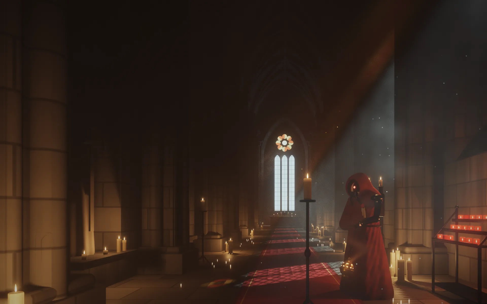

# Gothic corridor

This is a candlelit gothic hall where a hooded servitor swings a censer. Hand-written WebGL2 shaders draw all of it, with no image files and no 3D models. The hall, the servitor, the candles and the censer are signed distance functions, and the page raymarches them.



## Running the demo

From the root of this repository:

```sh
python3 -m http.server
```

Then open http://localhost:8000/gothic-corridor/. The page fetches its shaders, so it has to come from a server and not straight from the file.

The scene fills the window. Until the shaders have compiled and the hall has been baked, which takes about a second on a recent GPU, the page shows `preview.webp`, and the live scene fades in over it. Then the candles flicker, the censer swings, its smoke rises into the light and dust drifts through the shafts. It stops drawing while the tab is hidden or the scene is scrolled away. When the system asks for reduced motion, it draws one still frame.

When the scene cannot run, the page keeps `preview.webp` and labels it "Still image". That happens when the browser has no WebGL2 or no half-float render targets, when a shader fails to load or compile, or when the GPU drops the context a second time. A phone that is too slow for the bake usually ends up in the last case. The reason is written to the console.

## How it is drawn

1. **Bake.** The camera never moves, so the static hall is rendered once into four half-float layers: the daylight with the distance to each surface, the albedo, and the candle light reaching and reflected off each surface, split into four flicker groups. The bake runs in strips. Three more passes at sub-pixel offsets then smooth the edges and the soft shadows.
2. **Light volume.** The daylight in the air, through the window tracery and past the piers, is baked once into a 3D texture of 40 × 80 × 224 texels.
3. **Air.** At half resolution, each frame marches the haze, the light shafts and the censer's smoke through the light volume. The glow of each cluster of candles in the haze is added in closed form.
4. **Frame.** Each frame relights the bake with the current flicker, draws the swinging censer and lays the air over it.
5. **Sprites.** The flames, their reflections in the floor, the servitor's optic and the dust motes are small quads drawn on top.
6. **Grade.** Bloom, a filmic tone curve, a cool cast in the shadows, a vignette and film grain.

Every distance query in the bake goes through one loop with a single call to the scene: the ray from the camera, the samples for the normal, the occlusion samples and each shadow ray take their turn. The scene function is large, and the shader compiler copies it at every call, so one call keeps the bake shader quick to compile.

## What it costs

Measured in Chrome on an Apple M1 Max, at 0.8 megapixels:

- Compiling cold takes about 0.45 s for the bake shader, 0.2 s to link it and 0.27 s at its first draw, and under 0.2 s for each of the others.
- A full bake pass takes about 80 ms of GPU time. A frame takes under 2 ms.

A typical integrated laptop GPU is around 25 times slower than this one.

The scene never sends work to the GPU while the last strip or frame is still running. It draws at about 30 frames per second. When frames keep arriving late it drops to about 20, then to a lower resolution, and finally to a still frame. A first bake that takes longer than 1.5 s skips the refining passes.

## Files

- `js/main.js` fetches the shaders and starts the scene in the `.scene` element.
- `js/backdrop.js` decides when to bake, when to draw and when to slow down.
- `js/renderer.js` runs the passes.
- `js/scene.js` holds the hall's measurements, where the servitor stands, every candle, the censer's swing, the camera and the flicker.
- `js/gl.js` and `js/shared.js` are the WebGL helpers and the setup of the shader header, the noise, the sprites and the light volume.
- `shaders/hall.glsl` and `shaders/servitor.glsl` are the shapes and materials. `bake.frag` is the bake and `volume.frag` the light volume. `air.frag`, `smoke.glsl` and `motion.glsl` are the air, `frame.frag` and `censer.glsl` the frame, `sprite.vert` and `sprite.frag` the flames and dust. `bloom.frag`, `grade.glsl` and `final.frag` are the grade, and `common.glsl` holds the noise, distance functions, camera and windows they share.
- `preview.webp` is one frame of the scene.

The shaders also hold a `LIVE` mode that adds the light and the sprites over a rendered image of the scene, reading the scene's depth from a map. This page does not use it.

## Font

[Departure Mono](https://departuremono.com) by Helena Zhang, under the SIL Open Font License 1.1. The licence text is in `fonts/LICENSE-DepartureMono.txt`.
