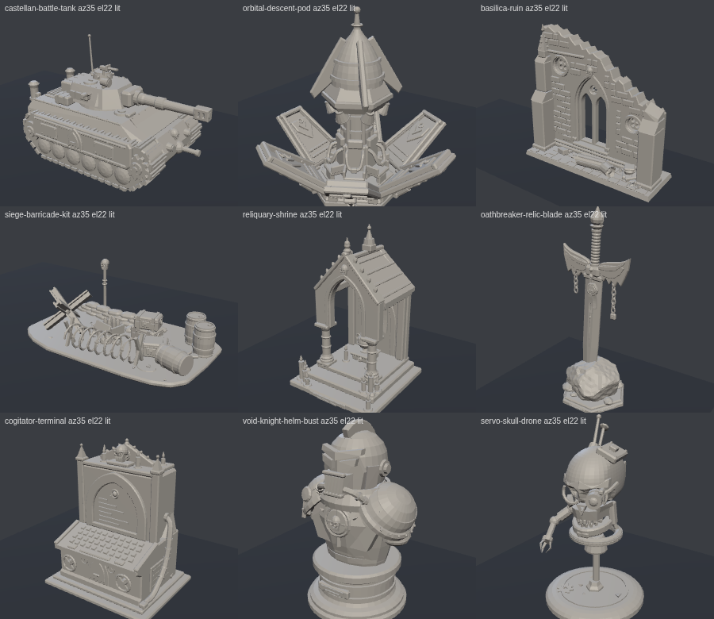

# STL models

These are nine models for 3D printing. They are original designs in a gothic sci-fi style: a tank and a drop pod, three pieces of terrain, two relics, a helm bust and a skull drone.

Each model was built in code from boxes, cylinders, turned profiles, extrusions, lofts and sweeps, with seeded noise to roughen stone, rock and sandbags.



The same views in flat green shading are in `previews/contact-green.png`.

## Running the demo

From the root of this repository:

```sh
python3 -m http.server
```

Then open http://localhost:8000/stl-models/ for the documentation page. It shows the demo and each feature in a frame, with the code that makes the feature work and the steps to add it to a page. The demo itself is at http://localhost:8000/stl-models/demo.html.

In the demo, pick a model from the list or step through them with the arrows under the stage. Drag to turn the model, and use the wheel, a pinch or the + and - buttons to zoom. Reset goes back to the first view. Read me in the bar opens a panel with the steps to add the viewer to another page. The model is fetched and parsed in the page, so the page has to come from a server and not straight from the file.

Under the stage are the model's name, its size in millimetres from its bounding box, its triangle count and a link to the file, and every model in the list has a link to its file as well. The floor under the model is drawn in 10 mm squares. The address can name a model, as in `#servo-skull-drone`.

The second row of buttons under the stage picks the look of the model. Plain is the lit grey model. Phosphor shades it in a few bands of amber, with a bright rim, faint crease lines and scanlines that crawl slowly upward. Wire draws the creases and a faint outline, and leaves out the lines that the model hides. X-ray draws the model see-through and brightest at its outline. On the dark theme X-ray glows where its layers overlap, and on the light theme it is drawn like ink.

In Phosphor, Wire and X-ray the model grows from the bottom behind a bright line. It does so when it loads and when one of these looks is picked after Plain, and Build plays the growth again. Build is greyed out in Plain. A plinth of two rings and a ring of ticks lies under the model in these looks, and a scan ring pulses outward from its centre.

The page opens in the dark theme, and the switch in the bar changes it to light. The looks change with the theme, and their colours are the `--ph-*` variables in `demo.css`. The model turns slowly on its own until it is dragged, and Turn switches that off and on. When the system asks for reduced motion, the model does not turn on its own or drift after a drag. It also appears whole without growing, the scanlines stand still and the scan ring is hidden. Build still plays the growth when it is pressed. A frame is drawn only while something on the stage moves and the stage is on screen. In Phosphor, Wire and X-ray the scanlines and the scan ring move all the time, so frames are drawn for as long as the stage is on screen.

Each feature of the demo can be shown on its own. Add `?feature=models` to the address of `demo.html` to show only the viewer, with the arrows, the zoom buttons, Reset and the model's file. Add `?feature=looks` to show one model in the four looks, with Build. A view opens in the dark theme, and the Looks view starts in Phosphor. The name in the bar links back to the full demo, and the back link goes to the documentation page.

Add `?embed` to hide the bar, the Read me and the text around the viewer, so that the page can be shown in a frame. It combines with a feature, as in `demo.html?feature=looks&embed`. The documentation page shows its frames this way.

## The models

| File | Model | Triangles | File size | Size, x × y × z |
|------|-------|----------:|----------:|-----------------|
| `castellan-battle-tank.stl` | Castellan-Pattern Battle Tank | 13,976 | 682.5 KB | 114.2 × 69.8 × 72.4 mm |
| `orbital-descent-pod.stl` | Orbital Descent Pod | 13,992 | 683.3 KB | 89.1 × 85.0 × 84.0 mm |
| `basilica-ruin.stl` | Basilica Ruin — Nave Section | 13,084 | 638.9 KB | 122.0 × 40.0 × 112.8 mm |
| `siege-barricade-kit.stl` | Siege-Line Barricade Kit | 11,740 | 573.3 KB | 101.4 × 62.1 × 36.5 mm |
| `reliquary-shrine.stl` | Reliquary Shrine | 10,780 | 526.4 KB | 60.0 × 61.0 × 95.2 mm |
| `oathbreaker-relic-blade.stl` | Oathbreaker Relic Blade | 8,210 | 401.0 KB | 55.9 × 47.7 × 148.3 mm |
| `cogitator-terminal.stl` | Cogitator Terminal | 10,548 | 515.1 KB | 70.0 × 56.0 × 85.4 mm |
| `void-knight-helm-bust.stl` | Void-Knight Helm Bust | 8,760 | 427.8 KB | 49.8 × 43.6 × 76.7 mm |
| `servo-skull-drone.stl` | Servo-Skull Drone | 8,044 | 392.9 KB | 38.0 × 39.2 × 67.3 mm |

A kilobyte here is 1024 bytes.

## The files

- The files are binary STL, in millimetres, with Z up.
- Each model is centred on X and Y and rests on z = 0. Its front faces −y.
- Every triangle carries its face normal. The 80-byte header holds the text `procedural STL (mm, Z-up)`.
- Each file holds the whole model in one piece, as it stands on the table. It is made of many closed parts that overlap where they meet, merged into one mesh without a boolean union. Every part is closed, has a positive volume and does not float.
- The models have no split parts, magnet sockets or supports.

The demo turns each model from Z-up to three.js' Y-up when it loads it, by a quarter turn about the x axis.

## Files

- `models/` holds the nine STL files.
- `index.html` is the documentation page.
- `demo.html` is the demo page.
- `demo.js` loads, shows and measures the models, and runs the theme switch, the Read me panel and the single-feature views. The script in the head of `demo.html` picks the view before the page is drawn. `demo.css` and `fonts/` give the page the look of the other demos.
- `looks.js` draws the Phosphor, Wire and X-ray looks with its own shader. It also draws the growth from the bottom, the plinth and the scan ring. `demo.js` draws Plain and switches between the looks.
- `previews/` holds two contact sheets of the nine models, one lit and one in flat green, rendered with three.js.
- `vendor/three/` holds the parts of [three.js](https://threejs.org) r186 that the page uses, unchanged from the npm package: `three.module.js` and `three.core.js` from `build/`, and `STLLoader.js` and `OrbitControls.js` from `examples/jsm/`. The import map in `demo.html` points `three` and `three/addons/` at them, so the page needs no build step and nothing from a CDN. three.js is under the MIT licence, in `vendor/three/LICENSE`.

## Font

[IBM Plex Mono](https://github.com/IBM/plex) by IBM, under the SIL Open Font License 1.1. The licence text is in `fonts/LICENSE-IBMPlexMono.txt`.
